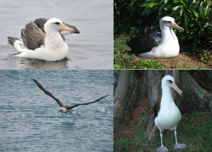

# Context-aware Captions from Context-agnostic Supervision

## Objective
Produce pragmatic, context aware descriptions of images using context agnositic data. We attempt the following two problems.
- ***Justification***:  
    - Given an image, a target(ground-truth) class, and a distractor class, describe the target image to explain why it belongs to the target class, and not the distractor class.
- ***Discriminative image captioning***
    -  Given two similar images, produce a sentence to identify a target image from the distractor image.

### Approch
We trained our model using generic **context-agnostic**  data (captions that describe a concept or an image in isolation), in a encoder-decoder paradigm along with attention, and used an inference techiqiue called **Emitter-Suppressor  Beam Search** to produce context aware image captions. Our models develops upon the arcthicture of [Show attend and tell](https://arxiv.org/pdf/1502.03044.pdf). For justification, apart from the image, the decoder is also conditioned on target-class. 

### Dataset
We use the CUB_2011 dataset which contains images of birds and their discriptions. The dataset has 200 bird classes (species), class has 30 images and each image has 10 discriptions. The discriptions are mostly about the morphology of birds, i.e.details about various parts of their body.

[Insert bird labels diagramme]()
 
### Implementation details 
- ***Encoder:*** 
    - We use a pretrained ResNet-34 already available in PyTorch's `torchvision`  module. Discarded the last two layers (pooling and linear layers), since we only need to encode the image, and not classify it.

- ***Decoder:*** 
  - We use lstms with input embedding of 512 and hidden states of size 1800. For justification the class is embeded into a 512 size vector.   

-  ***Attention*** 
    - We used adaptive pooling over encoder to get an `14*14*512` vector from the encoder, and then apply a linear layer with relu to get the attention weights. We used the soft version of attention. 

-  We use Adam's optimizer, with learning rate of 0.002 which is annealed every 5 epochs. We use dropout with with p = 0.5 . The batch size used was 64, and the number of epochs were 100. GTX 1060.

### Results 

| Image| Target class  | distractor class  |   Caption |
|:---:|---|---|---|
|  |   |   | Fafafafa jkbjbe bhbadhf bjdBHBHJA   | 
|   |   |   |   |   
|   |   |   |   |   


<!-- 

 -->


### Discussion 
It can be seen that context aware captions gives more information about the image than context agnositic captions. 
### References 
1. Paper: [Context-aware Captions from Context-agnostic Supervision](https://arxiv.org/pdf/1701.02870.pdf)
2. Dataset:
    - Images   : [CUB-200-2011](http://www.vision.caltech.edu/visipedia/CUB-200-2011.html)
    - Captions :  [Reed et al.](https://arxiv.org/abs/1605.05395) 

### Requirements and Dependencies
```
h5py          2.9.0   
matplotlib    3.0.3   
nltk          3.4.1     
numpy         1.16.2  
pandas        0.24.2  
pillow        5.3.0     
python        3.7.3   
pytorch       1.0.0   
torchfile     0.1.0   
torchvision   0.2.1   
tqdm          4.31.1  
```
### Setup 
To train pure imsgr

### Files and Folders 

