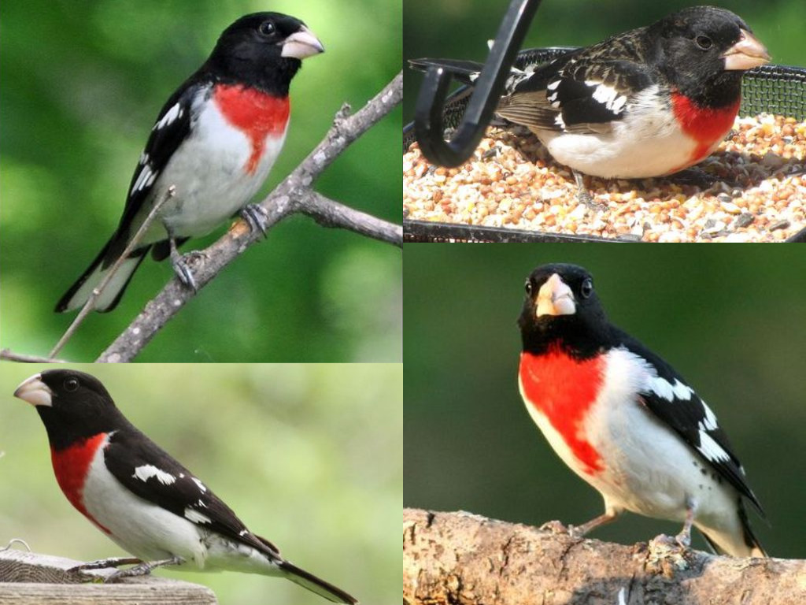

# Context-aware Captions from Context-agnostic Supervision

## Objective
Produce pragmatic, context aware descriptions of images (captions  that  describe differences between images or visual concepts) using context agnositic data (captions that describe  a  concept  or  an  image  in  isolation). We attempt the following two problems.
- ***Justification***:  
    - Given an image, a target (ground-truth) class, and a distractor class, describe the target image to explain why it belongs to the target class, and not the distractor class.
- ***Discriminative image captioning***
    -  Given two similar images, produce a sentence to identify a target image from the distractor image.

## Approach
We trained our model using generic **context-agnostic**  data (captions that describe a concept or an image in isolation), in an encoder-decoder paradigm along with attention, and used an inference techiqiue called **Emitter-Suppressor  Beam Search** to produce context aware image captions. Our model develops upon the architecture of [Show attend and tell](https://arxiv.org/pdf/1502.03044.pdf). For justification, apart from the image, the decoder is also conditioned on target-class. 
#### Emitter-Suppressor Beam Search Algorithm
<p align="center">
    

</p>

## Dataset
We have used the [CUB-200-2011](http://www.vision.caltech.edu/visipedia/CUB-200-2011.html) dataset which contains images of birds and their descriptions. The dataset has 200 bird classes (species), each class has 30 images and each image has 10 descriptions. The descriptions are mostly about the morphology of the birds i.e., details about various parts of their body.

<p align="center">
    
</p>
 
## Implementation details 
- ***Encoder*** 
    - We used a pretrained `ResNet-34` already available in the PyTorch's `torchvision`  module and discarded the last two layers (pooling and linear layers), since we only need to encode the image, and not classify it.

- ***Decoder*** 
  - We used LSTM's with `input embedding of size 512` and `hidden states of size 1800`. For justification the class is embeded into a `512 size vector`.   

-  ***Attention*** 
    - We used adaptive pooling over encoder to get a `14*14*512` vector from the encoder and then applied a linear layer with ReLu activation to get the attention weights. Note that we used the soft version of the attention. 

-  We used Adam's optimizer with `learning rate of 0.002` which is annealed every 5 epochs. We used dropout with `p = 0.5`. The `batch size used was 64` and the `number of epochs were 100`. The model was trained on GTX 1060 for 15 hours.

## Results 

### Context Agnostic Captioning 
| Image| Context Agnostic Caption |
|:---:|:---:|
|    | this bird has a white belly and breast with black superciliary and crown |
|    | this bird has a white head and breast with grey wings and a yellow beak |
|    | this bird has a yellow belly and breast with a black superciliary and gray crown |
|    | this bird has a white crown a white breast and grey wings with black edges |
|    | this bird has a red crown a short bill and a red breast |
|    | this bird has a long neck and a long bill |
|    | this bird has a long black bill and a black and white spotted body |
|    | this bird has a black crown a white breast and a large wingspan |
|    | this bird has a long yellow bill a black crown and red eyes |
|    | this bird has a white belly and breast with a brown crown and white wingbars |

### Justification Captioning 

| Image| Target class  | distractor class  |   Caption |
|:---:|:---:|:---:|:---:|
|   |    |    | this bird has a brown crown brown primaries and a brown throat | 
|      |   |    | this bird has a white belly and breast with a brown crown and wing | 
|        |    |    | this bird has a white crown as well as a black bill | 
|   |    |    | this bird has a brown crown brown primaries and a brown belly | 
|   |    |    | this bird has a blue crown green primaries and a yellow belly | 
|   |     |    | this bird has a yellow belly and breast with a black neck and crown | 
|   |     |    | this bird has a red crown red primaries and a red belly | 
|   |     |    | this bird has a pointed yellow bill with a yellow breast | 
|   |     |    | this bird has a yellow crown a short bill and a yellow breast | 
|   |     |    | this bird has a black crown white primaries and a white belly | 

### Discriminative Captioning 
| Target Image | Distractor Image | Caption | 
|:--:|:--:|:--:|
|   |   | this bird is brown in color over all of its body except for its wings and tail that have white around them | 
|   |   | this bird has wings that are gray and has a black tail and a black bill | 
|    |   | this bird has a brown crown brown primaries and a brown throat | 
|    |   | this bird has webbed feet with a bright orange wide beak and jet black over the rest of its body | 
|   |   | this bird has blackhead and body but there is fins of feathers off of the wing that are black white and red | 
|   |   | this bird has a white belly brown breast blue head and white wingbars | 
|   |   | a small brown bird with a white throat and red eyerings | 
|   |   | a small green bird with a yellow breast and yellow bill | 
|  |    | this bird has a white belly and breast with blue wings a light gray eyebrow on the head of a front of black and white striped on the wings and bright pale blue rectrices | 

<!-- 

 -->


<!-- ## Discussion 
It can be seen that context aware captions gives more information about the image than context agnositic captions.  -->

## Requirements

Kindly use the requirements.txt to set up your machine for replicating this project, some dependencies are :
```
h5py==2.9.0   
matplotlib==3.0.3   
nltk==3.4.1     
numpy==1.16.2  
pandas==0.24.2  
pillow==5.3.0     
python==3.7.3   
pytorch==1.0.0   
torchfile==0.1.0   
torchvision==0.2.1   
tqdm==4.31.1  
```
You can install these dependencies using `pip install -r requirements.txt`

## Setup 
#### Training
```
python datapreprocess.py \path\to\data\set \path\to\vocab\
python train.py
python train_justify.py 
```
#### Testing
Download the pretrained models [checkpoint_d](https://drive.google.com/open?id=1w4zF82hgbPmU9hAHsY92myjOU6HYD_BI) and [checkpoint_j](https://drive.google.com/open?id=1QLyqU5HZHYAyRJTSsIBPqG8zARU0oZUL)
1) Context agnostic captioning: 
` python beamsearch.py c image_path`
2) Justification:
` python beamsearch.py cj target_image_path target_class_path distractor_class_path `
3) Discrimination:
` python beamsearch.py cd target_image_path distractor_image_path `

<!-- ## Files and Folders  -->

## References 
1. Paper: [Context-aware Captions from Context-agnostic Supervision](https://arxiv.org/pdf/1701.02870.pdf)
2. Dataset:
    - Images   : [CUB-200-2011](http://www.vision.caltech.edu/visipedia/CUB-200-2011.html)
    - Captions :  [Reed et al.](https://arxiv.org/abs/1605.05395) 
3. A beautiful tutorial on [Show, Attend and Tell Implementation](https://github.com/sgrvinod/a-PyTorch-Tutorial-to-Image-Captioning)
